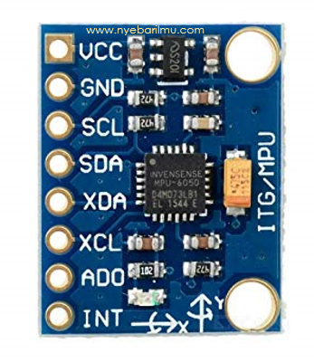
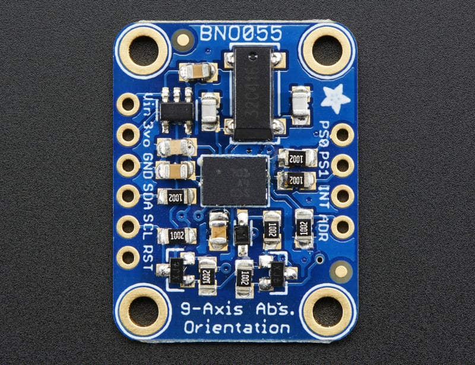

# Inertial Measurement Unit

Inertial Measurment Unit (IMU) adalah modul sensor yang biasanya digunakan untuk **orientasi** benda termasuk robot.

Orientasi biasanya direpresentasikan dalam format *Euler* atau *Quaternion*. Format *Euler* lebih mudah untuk dipahami sedangkan format *Quaternion* lebih mudah untuk komputasi, seperti rotasi, dan transformasi.

Format *Euler*:  
- *Roll* ($\phi$): rotasi terhadap sumbu X.
- *Pitch* ($\theta$): rotasi terhadap sumbu Y.
- *Yaw* ($\psi$): rotasi terhadap sumbu Z.

Mungkin paling gampang untuk memahami apa itu IMU adalah sensor untuk mengukur sudut.

## Sensor Penyusun IMU

IMU tidak bisa langsung mengukur orientasi/sudut.
Di dalam modul IMU terdapat 3 jenis sensor:  
- *Gyroscope*: mengukur kecepatan angular ($rad/s$).
- *Accelerometer*: mengukur percepatan linear ($m/s^2$).
- *Magnetometer*: mengukur medan magnet bumi ($\ \mu\text{T}$).

Setiap sensor tersebut bisa digunakan untuk menghitung sudut. Akan tetapi setiap jenis sensor tersebut memiliki kelebihan dan kekurangan masing-masing.

### Gyroscope
Gyroscope sangat responsif terhadap perubaha gerak.

Kelebihan:
- Mengukur laju perubahan sudut (angular rate) secara langsung.
- Respons cepat dan sangat stabil untuk gerakan jangka pendek.
- Tidak dipengaruhi gravitasi atau arah medan magnet.
- Akurasi tinggi dalam mendeteksi rotasi cepat.

Kekurangan:
- Drift: error terus bertambah meski sensor diam.
- Noise meningkat pada frekuensi tinggi.

### Accelerometer
Accelerometer mengukur sudut berdasarkan gravitasi bumi dan sangat akurat ketika diam.

Kelebihan:
- Mengukur percepatan linear untuk mengukur sudut roll dan pitch dari gravitasi.
- Tidak mengalami drift jangka panjang untuk orientasi statis.
- Dapat mendeteksi gerakan translasi dan getaran.

Kekurangan:
- Sangat sensitif terhadap noise dan getaran.
- Estimasi orientasi hanya untuk roll dan pitch, tidak bisa menghitung yaw.
- Saat sensor bergerak, percepatan gerak dan gravitasi tercampur, orientasi jadi tidak akurat.

### Magnetometer
Magnetometer mengandalkan medan magnet bumi selayaknya kompas untuk mendapatkan data yaw.

Kelebihan:
- Bisa memberikan heading (yaw) absolut berdasarkan medan magnet bumi.
- Tidak mengalami drift seperti gyroscope.

Kekurangan
- Sangat sensitif terhadap gangguan magnetik dari logam dan medan magnet lokal.
- Noise cukup tinggi jika lingkungan banyak logam.
- Tidak bisa mengukur roll dan pitch dengan akurat.

## Contoh Modul IMU

### MPU6050
MPU6050 (6-DOF) murah dan bagus kalau tau cara pakainya wkwk. Modul ini hanya terdiri dari Gyroscope dan Accelerometer. Versi yang ada Magnetometernya adalah MPU9250 (9-DOF).

### BNO055
BNO055 adalah sensor yang diproduksi oleh [Bosch Sensortec](https://www.bosch-sensortec.com/products/smart-sensor-systems/bno055/). Sensor ini memiliki sensor yang jauh lebih akurat daripada MPU6050 dan memiliki *processor* di dalamnya untuk sensor fusion. Oleh karena itu, data orientasi bisa langsung didapatkan secara akurat tanpa perlu melakukan perhitungan manual.

## External Resource

- Visualisasi hasil orientasi IMU: https://www.youtube.com/shorts/Wdof9bvGXQU

- Visualisasi penerapan pada robot: https://youtu.be/jF6dE3skI28