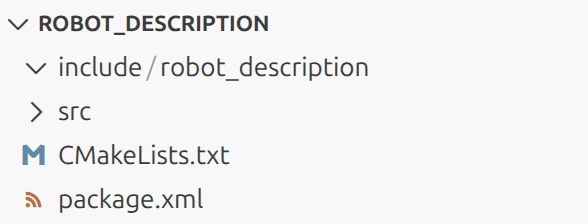
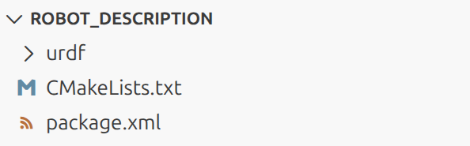
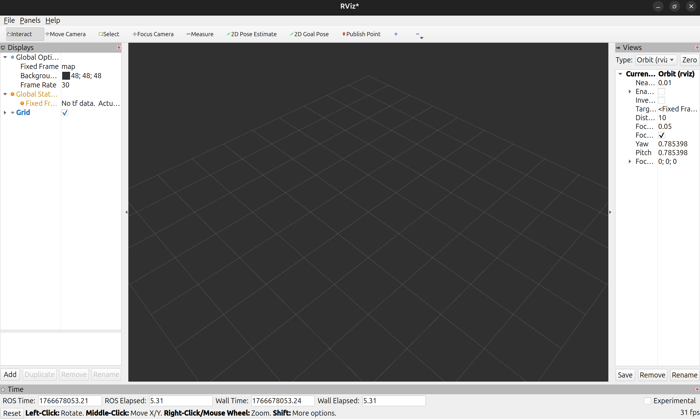

# URDF (Unified Robot Description Format)

URDF (Unified Robot Description Format) adalah format file standar yang digunakan untuk mendeskripsikan geometri, struktur, dan hubungan antarbagian robot dalam sistem ROS.

## Documentation

URDF Tutorial: https://docs.ros.org/en/jazzy/Tutorials/Intermediate/URDF/URDF-Main.html

URDF Tutorial Repository: https://github.com/ros/urdf_tutorial/tree/ros2

URDF Sim Tutorial Repo: https://github.com/ros/urdf_sim_tutorial/tree/ros2

**note**: imo kedua repo tersebut bukan best practice. seperti lompat2 kalau belum paham.

## Understanding From Scratch

### Dependencies

*Package* yang digunakan:
- ```robot_state_publisher```
- ```joint_state_publisher_gui```
- ```rviz2```
- ```xacro```

Cara install:
```bash
sudo apt install ros-$ROS_DISTRO-robot-state-publisher ros-$ROS_DISTRO-joint-state-publisher-gui ros-$ROS_DISTRO-rviz2 ros-$ROS_DISTRO-xacro
```

### Tutorial

Asumsi sekarang berada di dalam src workspace.
```bash
cd ~/ros2_ws/src
```

Buat *package* baru. Usahakan format namanya adalah ```{robot_name}_description```. *Package* boleh berformat ```ament_cmake``` atau ```ament_python```. Tutorial ini pakai ```ament_cmake```.
```bash
ros2 pkg create robot_description --build-type ament_cmake
```

Masuk ke dalam *package* (direktori) yang telah dibuat. Di dalam *package* susunannya seperti ini:



*Package* ini hanya berfungsi untuk mendefinisikan 3D dari robot dan tidak digunakan untuk membuat program. Karena itu, direktori ```include```, dan ```src``` dihapus. Kemudian buat direktori baru bernama ```urdf``` sehingga susunannya sekarang:


Buat file baru di dalam direktori ```urdf``` bernama ```01-myfirst.urdf```. File URDF ini berisikan deskripsi dari robot berformat XML. Kode berasal dari [Tutorial URDF ROS2](https://docs.ros.org/en/jazzy/Tutorials/Intermediate/URDF/Building-a-Visual-Robot-Model-with-URDF-from-Scratch.html):

```xml
<?xml version="1.0"?>
<robot name="myfirst">
  <link name="base_link">
    <visual>
      <geometry>
        <cylinder length="0.6" radius="0.2"/>
      </geometry>
    </visual>
  </link>
</robot>
```

Jalankan ```robot_state_publisher``` dengan asumsi sekarang berada di ```~/ros2_ws/src/robot_description```.
```bash
ros2 run robot_state_publisher robot_state_publisher --ros-args -p robot_description:="$(cat urdf/01-myfirst.urdf)"
```

Di terminal lain, jalankan ```rviz2```.
```bash
rviz2   # ros2 run rviz2 rviz2
```

Maka akan terbuka window:


