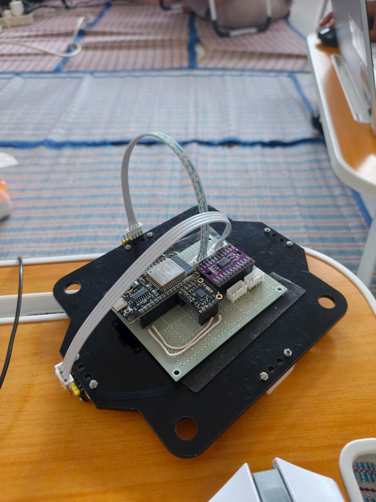

STEP 5 — MCU Serial Parser ESP32 dengan VL53L0X dan BNO055
===============================================================

Berbeda dengan implementasi sebelumnya yang menggunakan **6 channel ADC**, versi ini menggunakan data dari:

* 2 sensor **VL53L0X** (Time-of-Flight distance sensor)
* 1 sensor **BNO055** (IMU: orientation Euler)

Namun secara konsep, **arsitektur parser, state machine, dan protokol serial tetap sama**.

Gambaran Umum Sistem
------------------------

Sistem terdiri dari dua bagian utama:

* **ESP32 (Firmware)**

  * Membaca sensor VL53L0X melalui I2C multiplexer (TCA9548A)
  * Membaca orientasi dari BNO055
  * Mengemas data sensor ke dalam frame serial biner

* **ROS 2 Node (Python)**

  * Membaca byte serial dari ESP32
  * Melakukan parsing frame dengan state machine
  * Validasi CRC
  * Mempublish data ke topic ROS 2

Protokol Serial MCU
------------------------------

ESP32 mengirimkan data dalam bentuk frame biner dengan struktur berikut:

::

[STX][LEN][TYPE][SEQ][PAYLOAD][CRC][ETX]

Definisi Field
^^^^^^^^^^^^^^

* **STX**
  Byte awal frame (0x02)

* **LEN**
  Panjang data mulai dari TYPE sampai PAYLOAD (tidak termasuk CRC dan ETX)

* **TYPE**
  Tipe frame, digunakan untuk membedakan jenis data

* **SEQ**
  Sequence counter (uint8) untuk tracking frame

* **PAYLOAD**
  Data sensor (format tergantung TYPE)

* **CRC**
  XOR checksum dari TYPE, SEQ, dan PAYLOAD

* **ETX**
  Byte akhir frame (0x03)

Frame Sensor Status (VL53 + BNO055)
-------------------------------------

Frame ini digunakan untuk mengirimkan data sensor jarak dan orientasi.

Konstanta:

::

    STX  = 0x02
    ETX  = 0x03
    TYPE = 0x10

Payload Layout
^^^^^^^^^^^^^^

Payload memiliki panjang **10 byte** dengan susunan berikut:

::

    Offset 0-1 : VL53 #1 distance (uint16, mm)
    Offset 2-3 : VL53 #2 distance (uint16, mm)
    Offset 4-5 : Yaw   (int16, degree x100)
    Offset 6-7 : Pitch (int16, degree x100)
    Offset 8-9 : Roll  (int16, degree x100)

.. note::

    * Sudut dari BNO055 dikirim dalam bentuk **integer ter-skala** (degree x100)
    * Konversi ke float dilakukan di sisi ROS 2

Firmware ESP32
-------------------

.. code-block:: c++

    #include <Arduino.h>
    #include <Wire.h>
    #include <VL53L0X.h>
    #include <Adafruit_BNO055.h>
    #include <utility/imumaths.h>

    /* ================= PROTOCOL ================= */
    #define STX  0x02
    #define ETX  0x03
    #define FRAME_TYPE_SENSOR_STATUS 0x10

    /* ================= I2C ================= */
    #define TCA_ADDR 0x70

    /* ================= OBJECTS ================= */
    VL53L0X vl53;
    Adafruit_BNO055 bno = Adafruit_BNO055(55, 0x28);

    /* ================= VL53 CONFIG ================= */
    uint8_t vl53_channels[] = {3, 6};
    const uint8_t NUM_VL53 = 2;

    /* ================= STATE ================= */
    uint8_t sequence_number = 0;

    /* ================= CRC ================= */
    uint8_t compute_crc(uint8_t *data, uint8_t length)
    {
    uint8_t crc = 0;
    for (uint8_t i = 0; i < length; i++)
    {
        crc ^= data[i];
    }
    return crc;
    }

    /* ================= TCA SELECT ================= */
    void tcaSelect(uint8_t channel)
    {
    Wire.beginTransmission(TCA_ADDR);
    Wire.write(1 << channel);
    Wire.endTransmission();
    }

    /* ================= SEND FRAME ================= */
    void sendSensorFrame(
    uint16_t vl53_1,
    uint16_t vl53_2,
    float yaw,
    float pitch,
    float roll
    ) {
    int16_t yaw_i   = (int16_t)(yaw   * 100.0f);
    int16_t pitch_i = (int16_t)(pitch * 100.0f);
    int16_t roll_i  = (int16_t)(roll  * 100.0f);

    const uint8_t payload_length = 10;
    const uint8_t len_field = 1 + 1 + payload_length; // TYPE + SEQ + PAYLOAD

    uint8_t frame[1 + 1 + 1 + 1 + payload_length + 1 + 1];
    uint8_t idx = 0;

    frame[idx++] = STX;
    frame[idx++] = len_field;
    frame[idx++] = FRAME_TYPE_SENSOR_STATUS;
    frame[idx++] = sequence_number++;

    // VL53 #1
    frame[idx++] = vl53_1 & 0xFF;
    frame[idx++] = (vl53_1 >> 8) & 0xFF;

    // VL53 #2
    frame[idx++] = vl53_2 & 0xFF;
    frame[idx++] = (vl53_2 >> 8) & 0xFF;

    // Yaw
    frame[idx++] = yaw_i & 0xFF;
    frame[idx++] = (yaw_i >> 8) & 0xFF;

    // Pitch
    frame[idx++] = pitch_i & 0xFF;
    frame[idx++] = (pitch_i >> 8) & 0xFF;

    // Roll
    frame[idx++] = roll_i & 0xFF;
    frame[idx++] = (roll_i >> 8) & 0xFF;

    uint8_t crc = compute_crc(&frame[2], len_field);
    frame[idx++] = crc;
    frame[idx++] = ETX;

    Serial.write(frame, idx);
    }

    /* ================= SETUP ================= */
    void setup()
    {
    Serial.begin(115200);
    delay(1000);

    Wire.begin(21, 22);

    /* ---- VL53 INIT ---- */
    for (uint8_t i = 0; i < NUM_VL53; i++)
    {
        tcaSelect(vl53_channels[i]);
        delay(10);

        vl53.setTimeout(500);

        if (!vl53.init())
        {
        while (1); // fail fast
        }

        vl53.startContinuous();
    }

    /* ---- BNO055 INIT ---- */
    if (!bno.begin())
    {
        while (1);
    }

    bno.setExtCrystalUse(true);
    }

    /* ================= LOOP ================= */
    void loop()
    {
    uint16_t vl53_dist[2];

    // --- Read VL53 ---
    for (uint8_t i = 0; i < NUM_VL53; i++)
    {
        tcaSelect(vl53_channels[i]);
        delayMicroseconds(50);

        vl53_dist[i] = vl53.readRangeContinuousMillimeters();

        if (vl53.timeoutOccurred())
        {
        vl53_dist[i] = 0xFFFF; // invalid marker
        }
    }

    // --- Read BNO055 ---
    imu::Vector<3> euler = bno.getVector(Adafruit_BNO055::VECTOR_EULER);

    float yaw   = euler.x();
    float pitch = euler.y();
    float roll  = euler.z();

    // --- Send frame ---
    sendSensorFrame(
        vl53_dist[0],
        vl53_dist[1],
        yaw,
        pitch,
        roll
    );

    delay(50);
    }

Firmware ESP32 bertugas untuk:

* Inisialisasi I2C dan TCA9548A
* Membaca dua sensor VL53L0X di channel multiplexer tertentu
* Membaca orientasi Euler dari BNO055
* Membentuk frame serial dan mengirimkannya secara periodik

CRC dihitung menggunakan metode XOR sederhana (Checksum) untuk efisiensi dan determinisme.

ROS 2 MCU Serial Parser
-----------------------------

``mcu_serial_parser_2.py``

.. code-block:: python

    import rclpy
    from rclpy.node import Node
    import serial
    import struct
    import time

    from mcu_interfaces.msg import McuStatus2

    STX = 0x02
    ETX = 0x03
    FRAME_TYPE_SENSOR_STATUS = 0x10

    class McuSerialParser(Node):

        def __init__(self):
            super().__init__('mcu_serial_parser')

            self.last_frame_time = time.time()
            self.crc_error_count = 0
            self.timeout_sec = 1.0

            self.publisher = self.create_publisher(
                McuStatus2,
                'mcu/status',
                10
            )

            self.ser = serial.Serial(
                port='/dev/ttyUSB0',
                baudrate=115200,
                timeout=0.01
            )

            # ---------- Parser state ----------
            self.state = 'WAIT_STX'
            self.buffer = bytearray()
            self.expected_length = 0

            self.timer = self.create_timer(0.001, self.read_serial)

            self.get_logger().info('MCU Serial Parser (VL53 + BNO055) started')

        def read_serial(self):
            try:
                while self.ser.in_waiting > 0:
                    byte = self.ser.read(1)[0]
                    self.parse_byte(byte)
            except serial.SerialException:
                self.get_logger().warn('Serial disconnected, retrying...')
                self.reconnect_serial()

            # watchdog
            if time.time() - self.last_frame_time > self.timeout_sec:
                self.get_logger().warn('MCU timeout')

        def parse_byte(self, byte):
            if self.state == 'WAIT_STX':
                if byte == STX:
                    self.buffer.clear()
                    self.state = 'READ_LEN'

            elif self.state == 'READ_LEN':
                self.expected_length = byte
                self.buffer.clear()
                self.state = 'READ_BODY'

            elif self.state == 'READ_BODY':
                self.buffer.append(byte)
                if len(self.buffer) == self.expected_length + 1:  # + CRC
                    self.state = 'READ_ETX'

            elif self.state == 'READ_ETX':
                if byte == ETX:
                    self.process_frame(self.buffer)
                self.state = 'WAIT_STX'

        def process_frame(self, data):
            frame_type = data[0]
            seq = data[1]
            payload = data[2:-1]
            recv_crc = data[-1]

            # ---------- CRC ----------
            calc_crc = 0
            for b in data[:-1]:
                calc_crc ^= b

            if calc_crc != recv_crc:
                self.crc_error_count += 1
                self.get_logger().warn(f'CRC error ({self.crc_error_count})')
                return

            self.last_frame_time = time.time()

            if frame_type != FRAME_TYPE_SENSOR_STATUS:
                return

            if len(payload) != 10:
                self.get_logger().warn('Invalid payload length')
                return

            # ---------- UNPACK ----------
            vl53_1, vl53_2, yaw_i, pitch_i, roll_i = struct.unpack(
                '<HHhhh', payload
            )

            yaw   = yaw_i   / 100.0
            pitch = pitch_i / 100.0
            roll  = roll_i  / 100.0

            # ---------- ROS MSG ----------
            msg = McuStatus2()
            msg.stamp = self.get_clock().now().to_msg()
            msg.seq = seq
            msg.connected = True
            msg.valid = True
            msg.crc_error_count = self.crc_error_count
            msg.last_frame_age_sec = time.time() - self.last_frame_time

            msg.vl53_1 = vl53_1
            msg.vl53_2 = vl53_2
            msg.yaw = yaw
            msg.pitch = pitch
            msg.roll = roll

            self.publisher.publish(msg)

        def reconnect_serial(self):
            try:
                self.ser.close()
                time.sleep(1)
                self.ser.open()
                self.get_logger().info('Serial reconnected')
            except Exception:
                pass

    def main():
        rclpy.init()
        node = McuSerialParser()
        rclpy.spin(node)
        node.destroy_node()
        rclpy.shutdown()

Node ROS 2 ditulis dalam Python dan berfungsi sebagai **bridge** antara ESP32 dan ROS ecosystem.

Tanggung jawab utama node ini:

* Membaca stream serial byte-per-byte
* Menjaga sinkronisasi frame (STX / ETX)
* Menangani frame rusak atau CRC error
* Mengubah payload biner menjadi data numerik
* Mempublish data ke topic ROS

State Machine Parser
^^^^^^^^^^^^^^^^^^^^

Parser menggunakan state machine eksplisit untuk menjaga robustness:

::

    WAIT_STX  -> menunggu byte STX
    READ_LEN  -> membaca panjang frame
    READ_BODY -> membaca TYPE, SEQ, PAYLOAD, CRC
    READ_ETX  -> validasi ETX

Pendekatan ini memastikan:

* Parser tahan terhadap byte noise
* Resync otomatis jika terjadi frame corruption

Unpacking Payload
^^^^^^^^^^^^^^^^^

Payload di-unpack menggunakan modul `struct` Python:

.. code-block:: python

    struct.unpack('<Hhhhh', payload)

    atau

    struct.unpack('<5H', payload)

Artinya:

* Little-endian
* 2x uint16 (VL53)
* 3x int16 (Yaw, Pitch, Roll)

Nilai sudut kemudian dibagi 100 untuk mendapatkan satuan derajat.

ROS Message
---------------

``McuStatus2.msg``

.. code-block:: text

    builtin_interfaces/Time stamp
    uint8 seq
    bool connected
    bool valid
    uint32 crc_error_count
    float32 last_frame_age_sec

    uint16 vl53_1
    uint16 vl53_2
    float32 yaw
    float32 pitch
    float32 roll

Data dipublish menggunakan custom message `McuStatus2` dengan field utama:

* Jarak VL53L0X
* Orientasi IMU (Yaw, Pitch, Roll)
* Metadata komunikasi (seq, CRC error count, timestamp)

Message ini dirancang agar:

* Ringan
* Mudah di-extend
* Tidak terikat langsung ke message standar ROS

Hasil
----------

Terminal 1:

.. code-block:: bash

    cd ~/coding/ros2_ws_2
    colcon build
    source ./install/setup.bash
    ros2 run ros2_communication mcu_serial_parser_2

hasil:

.. code-block::

    doni@doniubuntu:~/coding/ros2_ws_2$ ros2 run ros2_communication mcu_serial_parser_2
    [INFO] [1767670635.762342481] [mcu_serial_parser]: MCU Serial Parser (VL53 + BNO055) started

Terminal 2:

.. code-block:: bash
    
    source ./install/setup.bash
    ros2 topic list
    ros2 topic echo /mcu/status

hasil:

.. code-block:: bash

    stamp:
        sec: 1767670502
        nanosec: 904973546
    seq: 156
    connected: true
    valid: true
    crc_error_count: 0
    last_frame_age_sec: 5.698204040527344e-05
    vl53_1: 47
    vl53_2: 58
    yaw: 0.0
    pitch: -2.430000066757202
    roll: 2.430000066757202
    ---
    stamp:
        sec: 1767670502
        nanosec: 960099572
    seq: 157
    connected: true
    valid: true
    crc_error_count: 0
    last_frame_age_sec: 7.534027099609375e-05
    vl53_1: 44
    vl53_2: 57
    yaw: 0.0
    pitch: -2.430000066757202
    roll: 2.430000066757202
    ---

Perbedaan dengan Parser ADC Sebelumnya
-----------------------------------------

Walaupun data sensornya berbeda, struktur sistem **tetap identik** dengan versi ADC:

* Protokol serial sama
* State machine sama
* Mekanisme CRC sama

Perbedaan utama hanya pada:

* Format payload
* Tipe frame
* Field message ROS

Catatan Penting Implementasi
-------------------------------

Beberapa hal yang perlu diperhatikan dalam pengembangan lanjutan:

* Selalu rebuild workspace setelah menambah atau mengubah message
* Pastikan TYPE frame konsisten antara ESP32 dan ROS 2
* Jangan mencampur format payload antar frame type
* Untuk integrasi lanjutan, IMU sebaiknya dipublish sebagai `sensor_msgs/Imu`